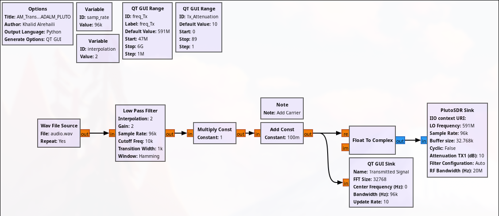

# AM Transceiver (Between Two SDRs)

This project explores the transmission of an audio file from the transmitter of one SDR to the receiver of another SDR (without clock synchronization).

<strong>Note: Since the demodulation technique used is not an envelope detector, the transmitter and receiver need to be highly synchronized.</strong>

To address this, we transmit a portion of the carrier signal along with the audio. On the receiver side, we detect the carrier peak and use it to re-center the clock, achieving relatively good synchronization between the two SDRs.

**Note:** Provide an audio file inside the same folder as the GRC files for the transmitters with the name **`audio.wav`**
 
# Table of Contents
- [AM Transmitter & Receiver for ADALM-PLUTO SDR](GNU-Radio-Files_ADALM-PLUTO)
- [AM Transmitter & Receiver for USRP B200 Mini](GNU-Radio-Files_USRP-B200mini)

# Flowgraph Images

1. ## ADALM-PLUTO AM Transmitter  
   

2. ## ADALM-PLUTO AM Receiver  
   

3. ## USRP B200 Mini AM Transmitter  
   

4. ## USRP B200 Mini AM Receiver  
   
