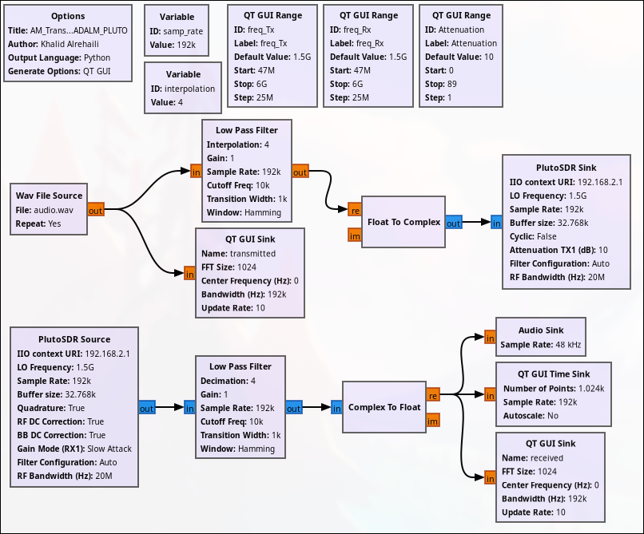
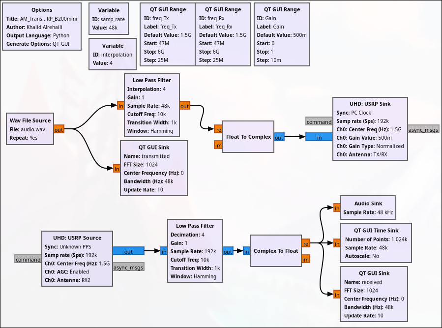

# AM Transceiver (Same SDR)

This project explores the transmission and reception of an audio file using both the transmitter and receiver of a single SDR.

**Note:** Please provide an audio file in the same folder as the GRC files with the name **`audio.wav`**.

# Table of Contents
- **[ADALM-PLUTO AM Transceiver](GNU-Radio-Files_ADALM-PLUTO)**
- **[USRP B200 Mini AM Transceiver](GNU-Radio-Files_USRP-B200mini)**

# Flowgraph Images

1. ## ADALM-PLUTO AM Transceiver  
   

2. ## USRP B200 Mini AM Transceiver  
   
