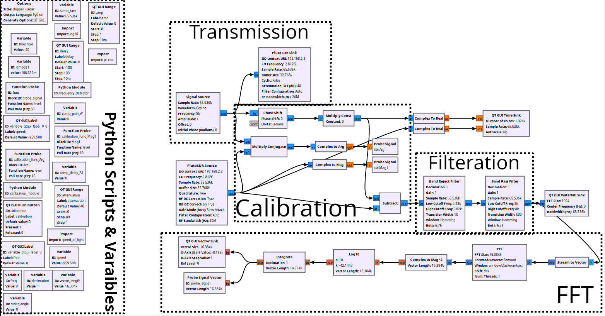

# CW Doppler Radar using USRP B200mini or (PLUTO SDR)
in this project, we made simple Continues Wave (CW) Doppler Radar. It works by tranmitting a sinusoidal wave at a known frequency e.g. 2.4GHz. When the signal get reflected from a moving target, the frequency will change due to the doppler effect. We then detect this shift and form it measure the speed of the target.

# Table of Contents
- [CW Doppler Radar using ADALM-PLUTO](GNU-Radio-Files_ADALM-PLUTO)
- [CW Doppler Radar using USBP-B200mini](GNU-Radio-Files_USRP-B200mini) 

## Flowgraph Image

