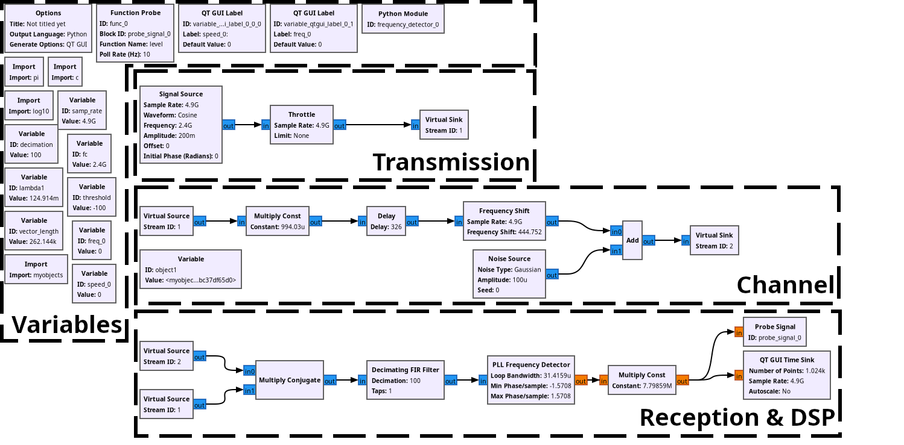

# CW Doppler Radar Simple Simulation

A CW Doppler radar simulation made using [GNU Radio](https://www.gnuradio.org/)

# Table of Contents
- [GNU Radio Simulation Files](GNU-Radio-Files)

## How does it work?
The simulation is divided into three main parts which are:
1. Generation & Transmission
	- A 2.4GHz sinusoidal signal is generated using the [Signal Source](https://wiki.gnuradio.org/index.php/Signal_Source) Block.
2. Environment & Target Modeling 
	- Object1 is defined which is our target. Default parameters are:
		1. Location as XYZ coordinates: 0, 0, 10, in meters (radar is the reference).
		2. Radial Velocity in (m/s): -40/3.6.
		3. Surface Area of the target: 1 (Was not integrated in the model which means it does not change anything).
	- Signal is attenuated depending on the target's position to emulate propagation attenuation.
 	- Signal delayed to take into account the speed of light.
	- Signal is frequency shifted depending on the target's speed (Doppler shift modeling).
	- Addition of noise source to take into account real-world environment.
3. Reception & DSP
	- Multiply conjugated between the transmitted and received signals. (Results in a signal which has the Doppler frequency).
	- [FIR Filter](https://wiki.gnuradio.org/index.php?title=Decimating_FIR_Filter), [PLL Frequency Detector](https://wiki.gnuradio.org/index.php?title=PLL_Frequency_Detector), and [Multiply Const](https://wiki.gnuradio.org/index.php?title=Multiply_Const) are blocks used to get the frequency of the signal as a digital number.
	- [Probe signal](https://wiki.gnuradio.org/index.php?title=Probe_Signal) to take the Doppler frequency and using simple mathematics to calculate speed in KM/H.

## Flowgraph Image

