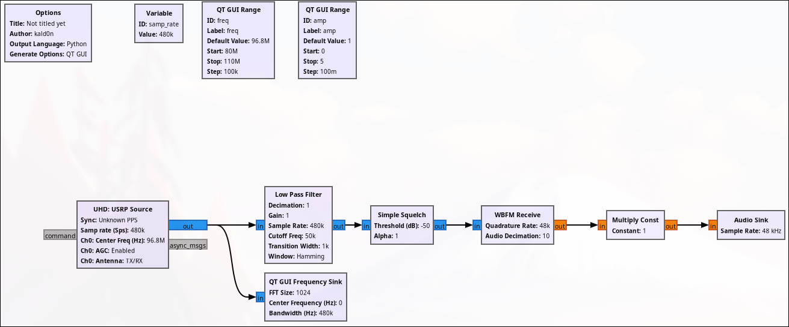

# FM Radio Project
FM Radio implementation made with [GNU Radio](https://wiki.gnuradio.org/index.php/Main_Page) and SDRs.  

# Table of Contents:

- [FM Radio using ADALM-PLUTO SDR](GNU-Radio-Files_ADALM-PLUTO)
- [FM Radio using USRP B200mini SDR](GNU-Radio-Files_USRP-B200mini)

# Flowgraph Image

