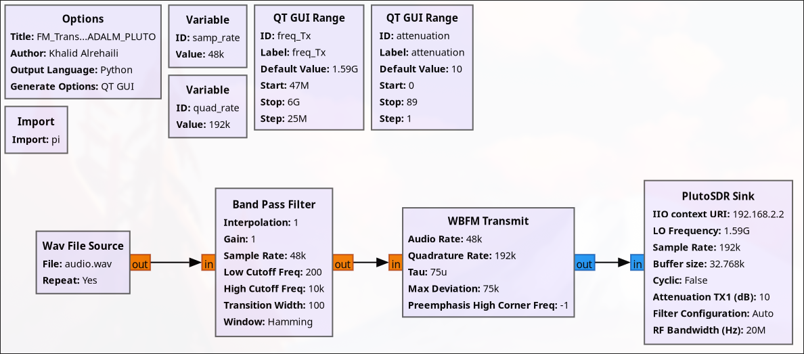
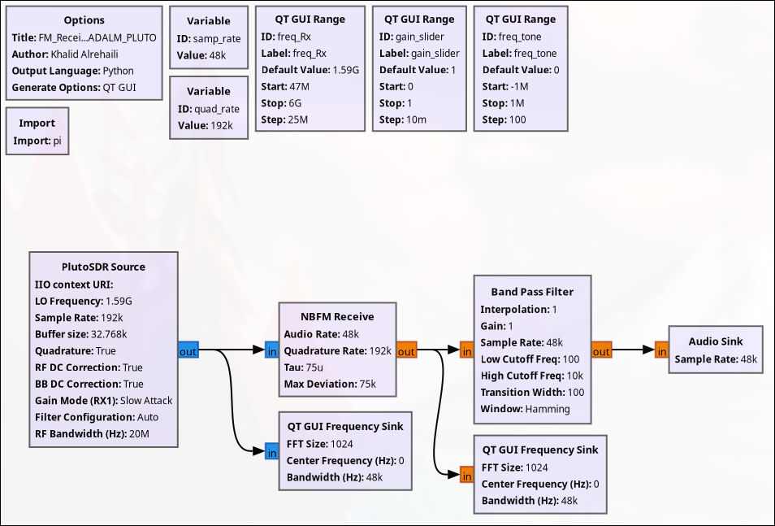
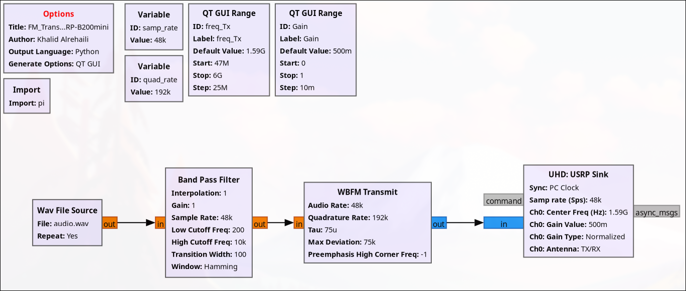
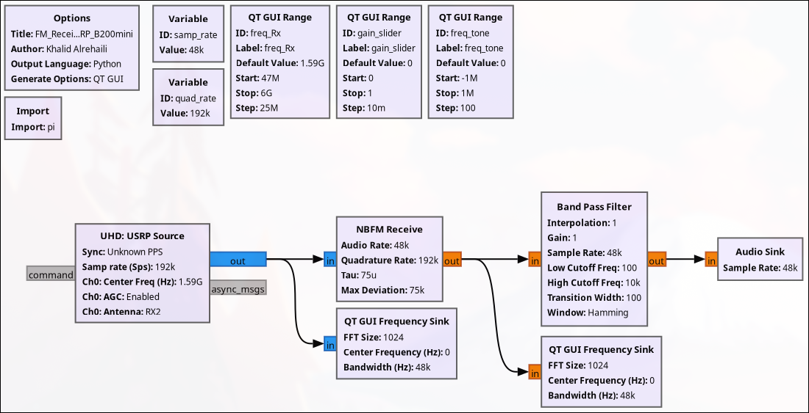

# FM Transceiver (Between Two SDRs)

This project explores the transmission of an audio file from one SDR's transmitter to another SDR's receiver (with no synchronization between SDRs' clocks).

The implementation has been done with two SDRs:  
1. [ADALM-PLUTO](https://www.analog.com/en/resources/evaluation-hardware-and-software/evaluation-boards-kits/adalm-pluto.html) — GRC files are found in [GNU-Radio-Files_ADALM-PLUTO](GNU-Radio-Files_ADALM-PLUTO)  
2. [USRP B200 Mini](https://www.ettus.com/all-products/usrp-b200mini/) — GRC files are found in [GNU-Radio-Files_USRP-B200mini](GNU-Radio-Files_USRP-B200mini)  

**Note:** Please provide an audio file in the same folder as the transmitter’s GRC file, named **`audio.wav`**.  

# Flowgraph Images

1. ## ADALM-PLUTO FM Transmitter  
   

2. ## ADALM-PLUTO FM Receiver  
   

3. ## USRP B200 Mini FM Transmitter  
   

4. ## USRP B200 Mini FM Receiver  
   
