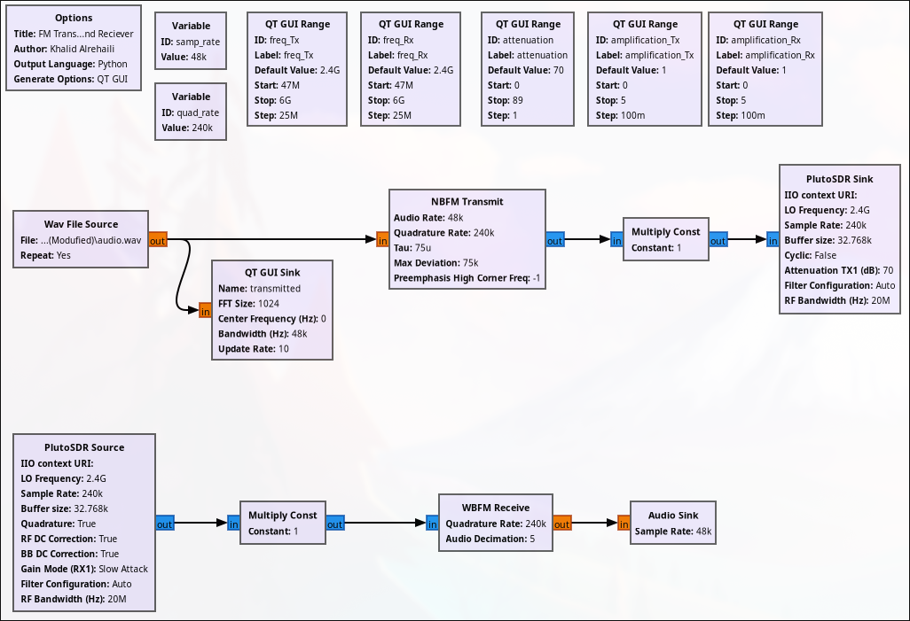

# FM Transceiver (Same SDR)

The goal of this project is to transmit an audio file between the transmitter and receiver of the same SDR (clock synchronization is garnteed) using frequency modulation (FM).

# Table of Contents
- [FM Transceiver using ADALM-PLUTO SDR](GNU-Radio-Files_ADALM-PLUTO)  
- [FM Transceiver using USRP B200mini SDR](GNU-Radio-Files_USRP-B200mini)  

It can also be implemented with any SDR that is compatible with GNU Radio.

**Note:** Please add an audio file in the same folder as the GRC file, named **`audio.wav`**.

# Flowgraph Image

