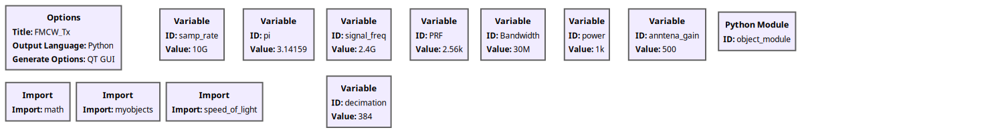
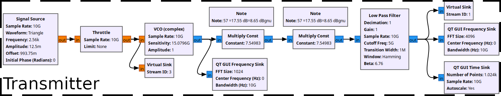
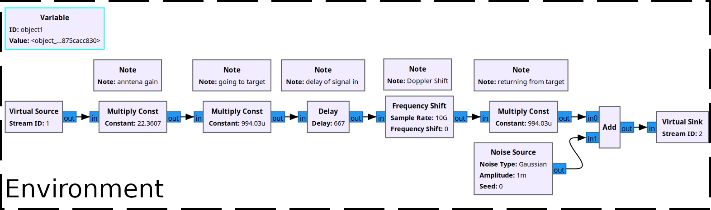
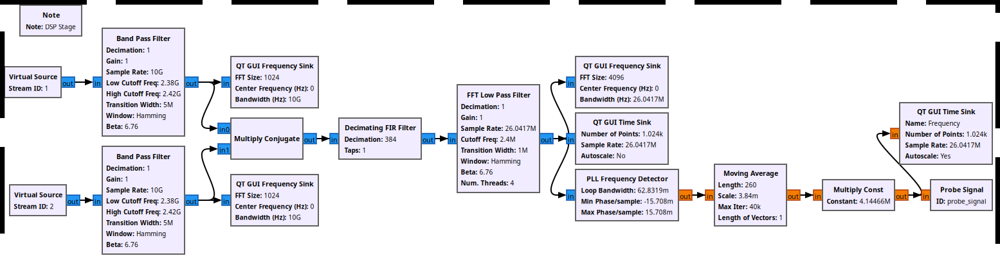
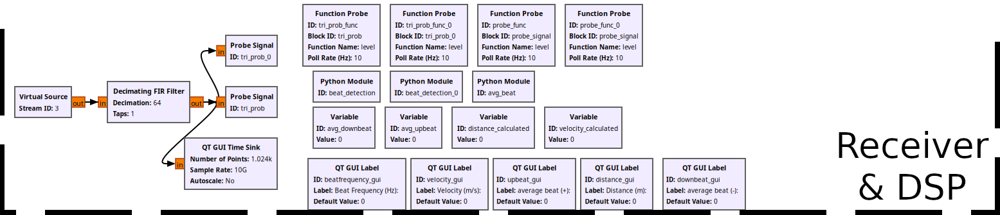

# Frequency Modulated Continuous Wave (FMCW) Radar Simulation

This is an **FMCW Radar simulation** implemented using [GNU Radio](https://www.gnuradio.org/).

FMCW radars are commonly used when accurate **range** and **velocity** measurements are required, especially in **low-power, compact systems**. There are many modulation schemes that can be employed, but in this simulation we use a **triangular chirp** scheme. Additionally, a very **high sample rate** is used to demonstrate that these signals are simulated in the *analog domain*, rather than in a digital domain.

## Flowgraph Images

1.   
2.   
3.   
4.   
5. 
